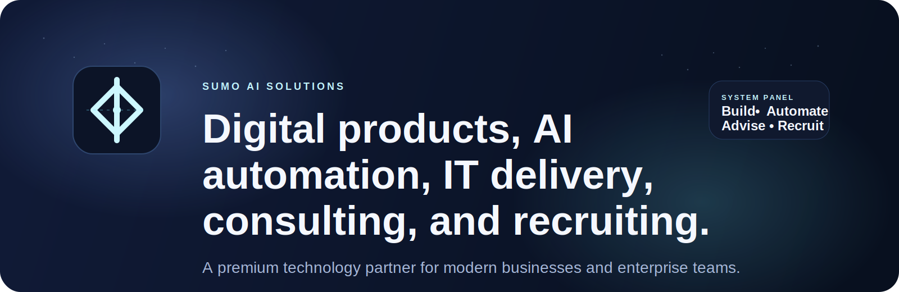
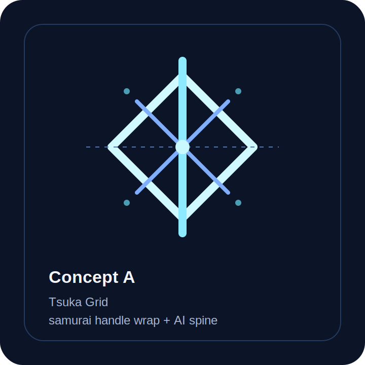
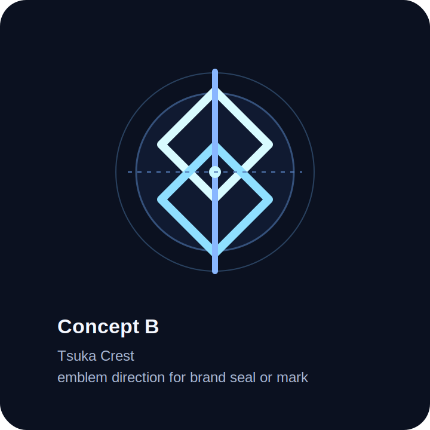
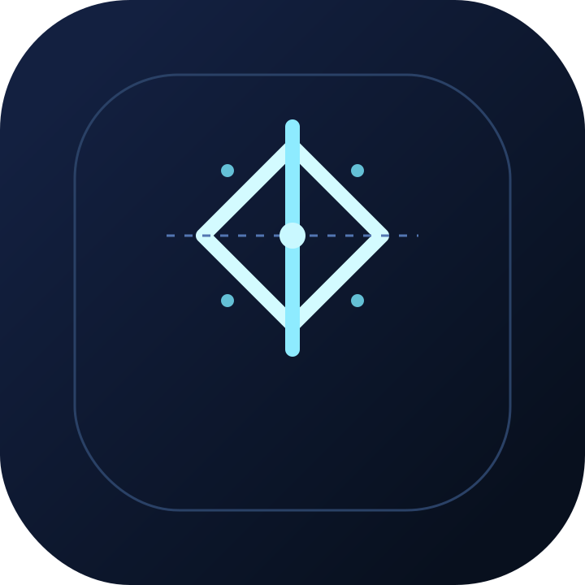
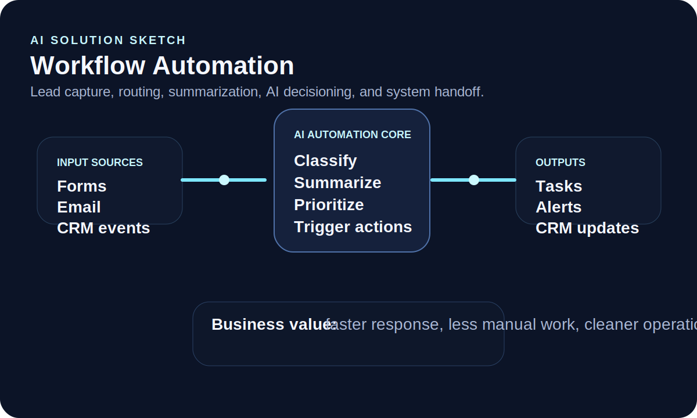
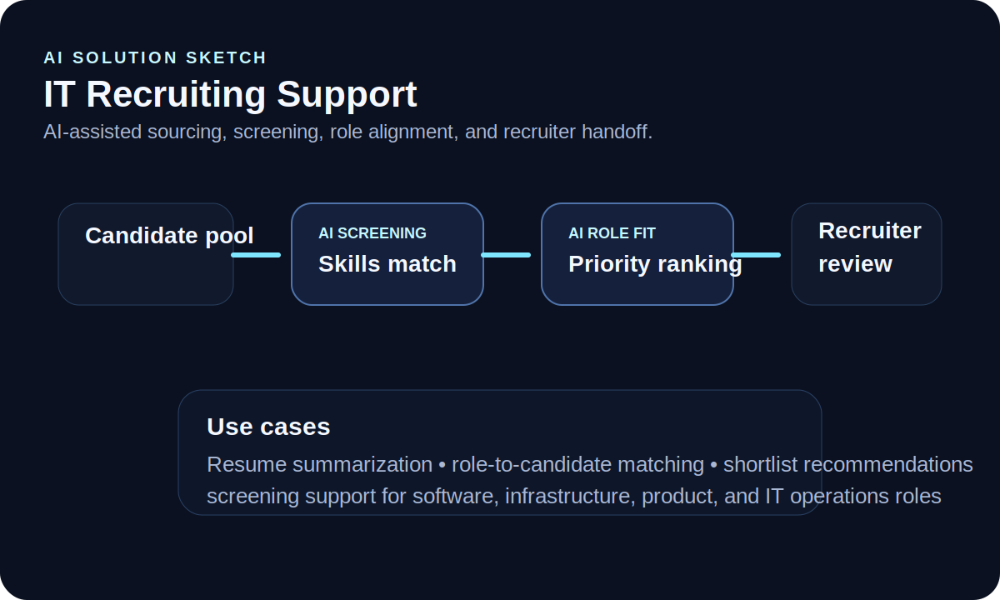
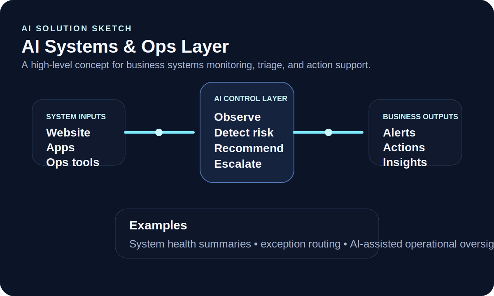

# SUMO AI Solutions

## ⚔️ About SUMO AI Solutions

**SUMO AI Solutions** is a modern technology partner focused on building, improving, and staffing high-value digital systems for businesses that need real execution.

We help clients launch and scale:

- 🤖 **AI automation systems**
- 🌐 **Websites and web applications**
- 📱 **Mobile apps**
- 🛠️ **IT systems and operations**
- 🧭 **Technical consulting and embedded delivery**
- 👥 **IT recruiting and talent support**

Our positioning is straightforward: we are not only a website studio. We operate across **digital product development, AI business integration, technical consulting, and IT talent solutions**.

---

## 🚀 What We Offer

### 🧱 Full Service Coverage

SUMO AI Solutions is designed to support companies that need more than one isolated service. We provide a broad IT and software delivery offering that can cover strategy, design, implementation, optimization, and talent support.

- 🌐 **Website creation and website development**
- 🖥️ **Web application development**
- 📱 **Mobile app development for iOS and Android**
- 🤖 **AI integration for business**
- ⚙️ **Business automation and workflow optimization**
- 🧭 **Software consulting and IT consulting**
- 🏢 **Custom business systems and internal tools**
- 🔌 **Systems integration and modernization**
- 👥 **IT recruiting and technical talent support**

### 🤖 AI Automation & Intelligent Systems

We design practical AI solutions that improve speed, decision-making, and operational efficiency.

- Workflow automation
- AI copilots and assistants
- Internal AI tools
- AI-enhanced support flows
- AI implementation for existing businesses
- AI process automation
- AI-powered knowledge systems
- Process optimization
- Business system integrations
- Operational efficiency improvements

### 🌐 Website & Web Application Development

We build modern digital products from scratch and improve existing platforms.

- Website design and redesign
- Marketing websites
- Landing pages
- Business websites
- Corporate websites
- Professional service websites
- Conversion-focused web pages
- Ecommerce presentation layers
- Customer portals
- Dashboards
- Internal tools
- SaaS interfaces
- Operations dashboards
- Custom web applications

### 📱 Mobile App Development

We support mobile product strategy and delivery across:

- iOS applications
- Android applications
- cross-platform mobile product planning
- companion apps for business systems
- mobile interfaces for field teams and operations
- customer-facing mobile experiences
- internal operational mobile tools

### 🛠️ IT Services, Systems, & Integration

We also support the business-critical systems behind the customer-facing product layer.

- Custom business systems
- Internal operations platforms
- Workflow systems
- CRM and process integrations
- Systems integration
- Legacy modernization
- Process improvement
- Technical implementation support
- Infrastructure-minded solution planning

### 🧭 Consulting & Embedded Technical Teams

We work as a delivery partner, implementation partner, or embedded team extension.

- Technical consulting
- Software consulting
- IT consulting
- Solution architecture
- Systems modernization
- Implementation support
- Fractional technical leadership
- Project rescue and delivery stabilization
- Product and systems planning

### 👥 IT Recruiting & Talent Solutions

We also help businesses strengthen technical teams with focused recruiting support in the IT sphere.

- Technical recruiting
- Candidate sourcing
- Screening support
- Team augmentation
- Delivery-minded staffing support
- Technical role definition support
- Recruiting help for growing software and IT teams

### 📦 Typical Engagement Types

Clients work with SUMO AI Solutions for needs such as:

- building a website from scratch
- redesigning or modernizing an existing website
- creating a custom web application
- building an iOS or Android app
- integrating AI into business workflows
- automating repetitive operational tasks
- improving efficiency with internal tools and systems
- getting senior technical consulting on a software initiative
- improving delivery quality, architecture, or execution
- finding technical talent to support ongoing work

---

## 🏢 Who We Work With

SUMO AI Solutions is structured to support a wide range of client environments:

- startups
- local businesses
- founder-led ventures
- growth-stage companies
- enterprise and corporate teams

Whether the need is a clean new website, a full business system, AI process automation, or technical recruiting support, the goal stays the same: **deliver useful systems that create leverage**.

---

## 🧠 Business Pillars

### 1. Digital Product Development

We build:

- websites from scratch
- landing pages
- business websites
- web apps
- mobile apps
- business systems
- client-facing digital experiences

### 2. AI Business Integration

We help organizations apply AI in ways that are practical and measurable:

- automate repetitive workflows
- improve internal processes
- streamline operations
- add intelligence to existing systems
- deploy practical AI tools inside organizations
- support revenue and efficiency goals

### 3. Consulting, Delivery, and Recruiting

We support businesses not only with software, but with execution capacity:

- consulting
- software and IT services
- systems integration support
- technical delivery support
- IT recruiting support

---

## 🎯 Brand Direction

The SUMO AI Solutions brand should feel like:

- precise
- disciplined
- modern
- premium
- dependable
- technical without being cold

The creative direction we are exploring combines:

- **samurai-inspired discipline**
- **clean digital systems aesthetics**
- **AI infrastructure cues**
- **strong, iconic geometry**

The sword reference is being explored through the idea of a **samurai handle / tsuka-inspired wrap pattern** that can become a memorable icon for the website, app window, or future brand mark.

---

## 🖼️ First Sketch Concepts

These are early concept sketches only.

### Brand / Icon Concepts

| Concept | Preview | Direction |
| --- | --- | --- |
| Concept A |  | A geometric handle-wrap motif with a strong central spine and AI-like structure. |
| Concept B |  | A crest-style symbol with woven handle energy and a more emblematic feel. |
| Window Icon |  | A simplified square app icon concept designed for a browser tab, app tile, or OS window icon. |

### AI Solution Sketches

| Solution | Preview |
| --- | --- |
| AI Automation |  |
| AI Recruiting |  |
| AI Systems & Ops |  |

---

## 🧩 Website Notes

This repository currently contains a static marketing site for GitHub Pages deployment.

### Technical setup

- `index.html` – homepage structure
- `style.css` – styling, layout, responsive behavior
- `script.js` – interaction layer and animated background logic
- `portfolio/index.html` – reserved portfolio route
- `CNAME` – custom domain mapping

### Current site direction

- dark premium visual style
- responsive landing page layout
- lightweight animated background
- business-focused messaging
- portfolio path reserved for future expansion

---

## 🔭 Planned Expansion

Future additions may include:

- a full portfolio and case study system
- deeper AI service pages
- recruiting and staffing landing pages
- industry-specific solution pages
- refined logo and favicon package
- polished brand guidelines

---

## 🤝 Contact Direction

SUMO AI Solutions is designed to serve clients that need:

- a serious digital partner
- modern websites and apps
- AI automation for business
- software consulting and IT consulting
- systems integration and process improvement
- consulting and implementation support
- recruiting and technical staffing help

If the goal is to build cleaner systems, move faster, and operate more intelligently, that is exactly where SUMO AI Solutions fits.
